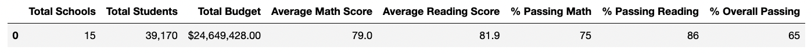
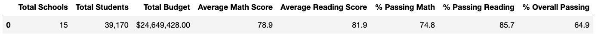
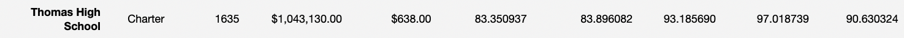
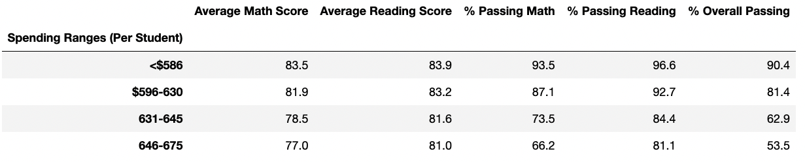
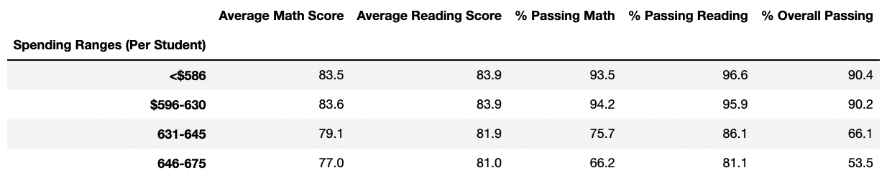

# school_district_analysis

## Project Overview
We have been tasked with analyzing school district data from local high schools. This overview compares our original PyCitySchools analysis to our updated analysis that removed 9th grade math and reading scores from Thomas High School. We have performed the following tasks:

1. Replaced ninth-grade math and reading scores from Thomas High School with NaN.

2. Repeated the school district analysis including the following items:
    - The district summary
    - The school summary
    - The top 5 and bottom 5 performing schools, based on the overall passing rate
    - The average math score for each grade level from each school
    - The average reading score for each grade level from each school
    - The scores by school spending per student, by school size, and by school type
    

## Resources
[PyCitySchools_Challenge](PyCitySchools_Challenge.ipynb)

[PyCitySchools_Original](PyCitySchools.ipynb)

## Results
Below are the results for how each part of the analysis changed due to the removal of the 9th grade scores from Thomas High School.

### The District Summary
Changes in the district summary were largely negligble.

**District Summary Original**

**District Summary Challenge**

### The School Summary
Removal of the ninth grade scores from the math, reading, and overall percentages resulted in a significant increase in these scores for Thomas High School. Math was increased from 66.9% to to 93.1%, reading was increased from 69.6% to 97.0%, and the overall passing percentage was increased from 65.0% to 90.6%. 

**School Summary Original**

**School Summary Challenge**

### Top 5 and Bottom 5 Schools
The standings of the schools did not changed based on our alterations.

### Average Math Scores by Grade Level
The average math scores for each high school based on grade were analyzed. As expected only data for Thomas High School's 9th grade class were altered.

### Average Reading Scores by Grade Level
The average reading scores for each high school based on grade were analyzed. As expected only data for Thomas High School's 9th grade class were altered.

### Scores by School Spending, School Size, and School Type
Scores based on school spending were significantly increased for the $596-630 and $631-645 spending ranges in the updated school spending summary when compared to the original. The increase was consistent across math and reading and is reflected in the overall passing percentage, which increased from 81.4% to 90.2% (Spending Range: $596-630) and from 62.9% to 66.1% (Spending Range: $631-645). 

Scores based on school size and type did not significantly change due to the removal of Thomas High School 9th graders from the analysis.

## Summary
In this challenge we reanalyzed school district data after switching scores from Thomas High School's 9th grade class to NaN for math and reading. Our updated analysis finds this results in a substantial increase in the passing percentages (math, reading, and overall) for schools that spend between $596-630 and $631-645 per student. This data may help schools and districts better understand how to allocate funds to maximize student and school performance.
